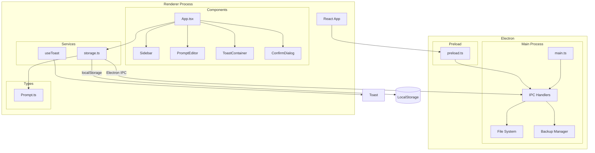
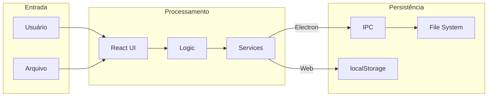

# Arquitetura do Sistema

## Visão Geral

O PromptsManager é uma aplicação Electron com frontend React que gerencia uma coleção de prompts. O sistema segue uma arquitetura cliente-servidor local, onde o processo principal (main) do Electron acts como servidor de persistência e o renderer (React) como interface do usuário.



## Camadas da Aplicação

### 1. Camada de Apresentação (UI)
Componentes React que definem a interface do usuário:
- **App**: Componente raiz que coordena estado global
- **Sidebar**: Lista de prompts, filtros, busca, ordenação
- **PromptEditor**: Editor de conteúdo do prompt
- **ToastContainer**: Sistema de notificações
- **ConfirmDialog**: Dialog de confirmação

### 2. Camada de Lógica de Negócio
Estado e funções React que implementam regras de negócio:
- Gerenciamento de CRUD de prompts
- Busca, filtros e ordenação
- Merge de prompts importados
- Validação de dados

### 3. Camada de Serviços
Abstrações para operações externas:
- **storage.ts**: Persistência de dados
- **useToast**: Sistema de notificações

### 4. Camada de Dados
Modelos e tipos TypeScript:
- **Prompt**: Interface do modelo de prompt

### 5. Camada de Infraestrutura
Electron e operações de sistema:
- **main.ts**: Processo principal
- **preload.ts**: Bridge seguro entre processos
- Sistema de arquivos
- Backup automático

## Fluxo de Dados



## Stack Tecnológica

| Camada | Tecnologia |
|--------|------------|
| UI | React 18 + TypeScript |
| Build | Vite |
| Desktop | Electron |
| Styling | CSS Modules |
| Persistência | Electron IPC / localStorage |
| Build Desktop | electron-builder |

## Padrões Arquiteturais

### 1. Component-Based Architecture
- Componentes React isolados e reutilizáveis
- Props drilling para dados父 компонент → filhos
- Estados locais quando possível, globais quando necessário

### 2. Service Layer Pattern
- **storage.ts** abstrai detalhes de persistência
- UI não precisa saber se está no Electron ou Browser

### 3. Hook Pattern
- **useToast** encapsula lógica de notificações
- Hooks customizados para lógica reutilizável

### 4. IPC Bridge Pattern
- **preload.ts** expõe APIs seguras para renderer
- Isola processo principal do renderer

## Diretórios e Estrutura de Arquivos

```
prompts-manager/
├── electron/
│   ├── main.ts          # Processo principal
│   └── preload.ts       # Bridge IPC
├── src/
│   ├── components/      # Componentes React
│   │   ├── Sidebar/
│   │   ├── PromptEditor/
│   │   ├── PromptList/
│   │   ├── ToastContainer/
│   │   ├── ConfirmDialog/
│   │   └── MarkdownPreview/
│   ├── hooks/          # Hooks customizados
│   │   └── useToast.ts
│   ├── services/       # Serviços
│   │   └── storage.ts
│   ├── types/          # Tipos TypeScript
│   │   └── Prompt.ts
│   ├── App.tsx         # Componente raiz
│   └── main.tsx        # Entry point
├── docs/
│   └── diagrams/       # Documentação UML
│       ├── caso-de-uso.md
│       ├── classes.md
│       └── sequencial.md
└── package.json
```

## Modos de Execução

### Modo Web (Browser)
- Usa localStorage para persistência
- Deploy no Netlify/Vercel

### Modo Desktop (Electron)
- Usa sistema de arquivos via IPC
- Backup automático
- Acesso a APIs nativas do SO