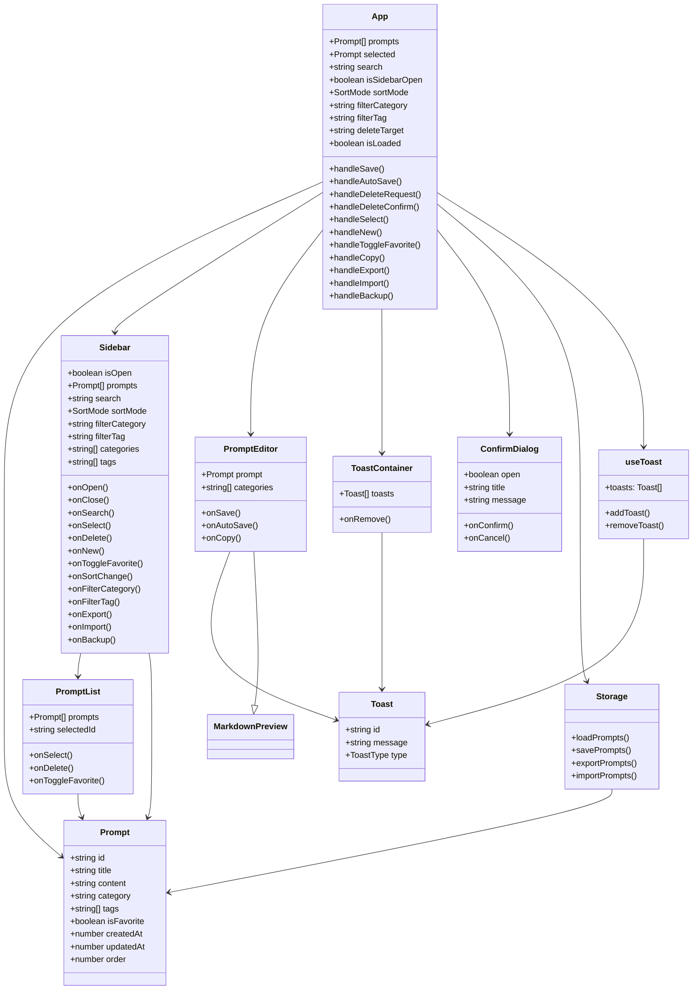

# Diagrama de Classes

## Descrição das Classes

| Classe | Responsabilidade |
|--------|-----------------|
| **Prompt** | Modelo de dados que representa um prompt individual |
| **App** | Componente principal que gerencia estado e coordena funcionalidades |
| **Sidebar** | Gerencia lista de prompts, busca, filtros e ordenação |
| **PromptEditor** | Editor de conteúdo do prompt com campos de título, conteúdo, categoria e tags |
| **PromptList** | Exibe lista de prompts na sidebar |
| **ToastContainer** | Exibe notificações temporárias (sucesso, erro, info) |
| **ConfirmDialog** | Dialog de confirmação para ações destrutivas |
| **Toast** | Modelo de dados para notificações |
| **Storage** | Abstração de persistência (Electron IPC ou localStorage) |
| **useToast** | Hook React para gerenciar toasts |

## Relacionamentos

- **App** é o componente raiz que coordena todos os demais
- **Sidebar** lista e filtra prompts, comunica seleção ao App
- **PromptEditor** permite edição e cria/modifica prompts
- **Storage** abstrai a persistência de dados
- **useToast** fornece sistema de notificações para feedback ao usuário