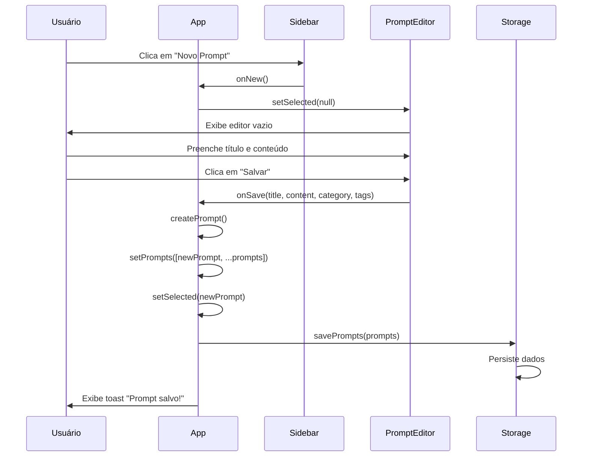
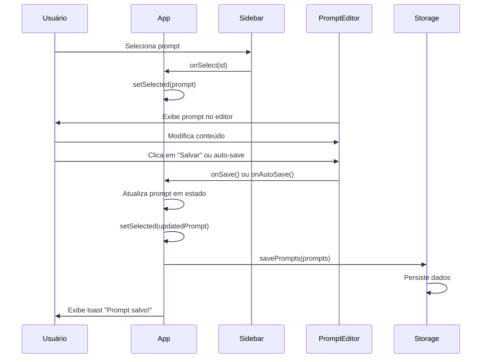
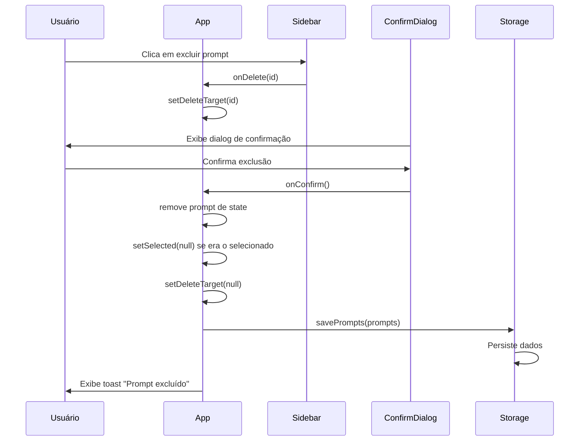
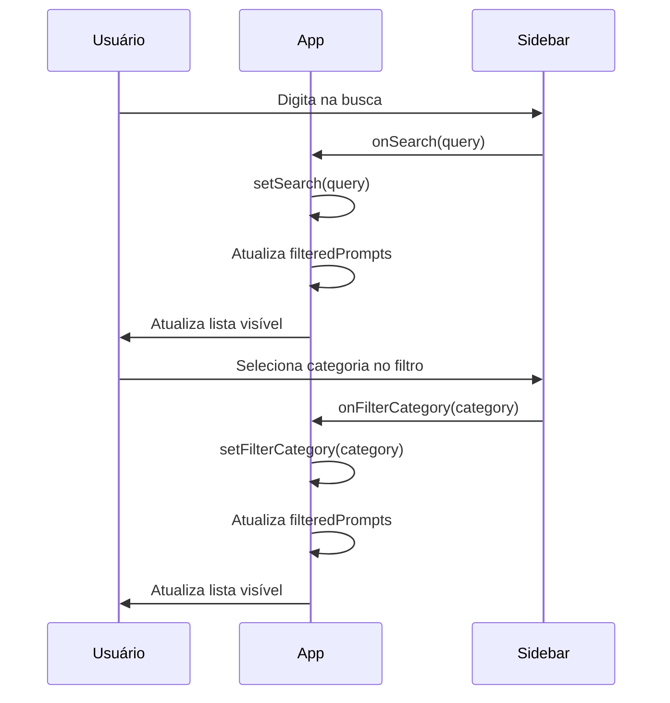
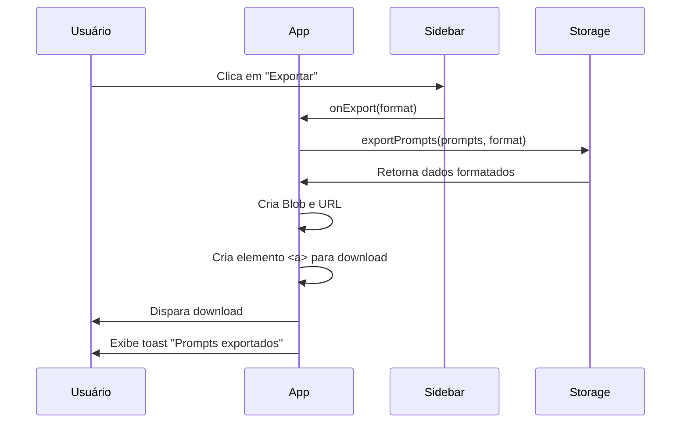
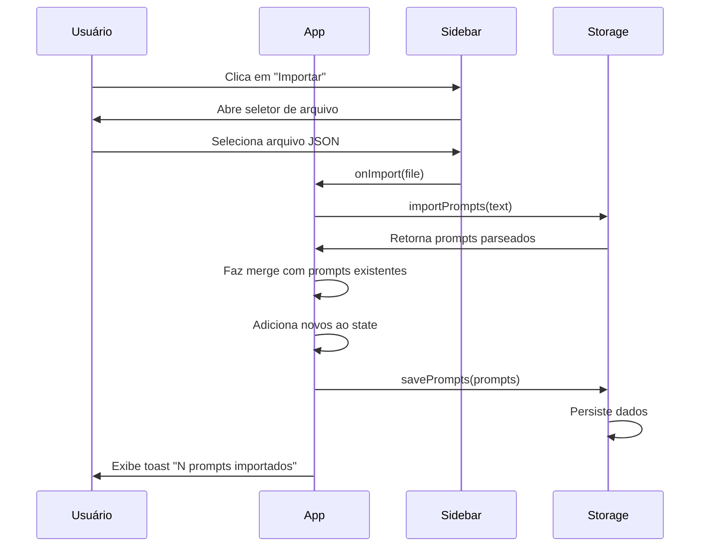
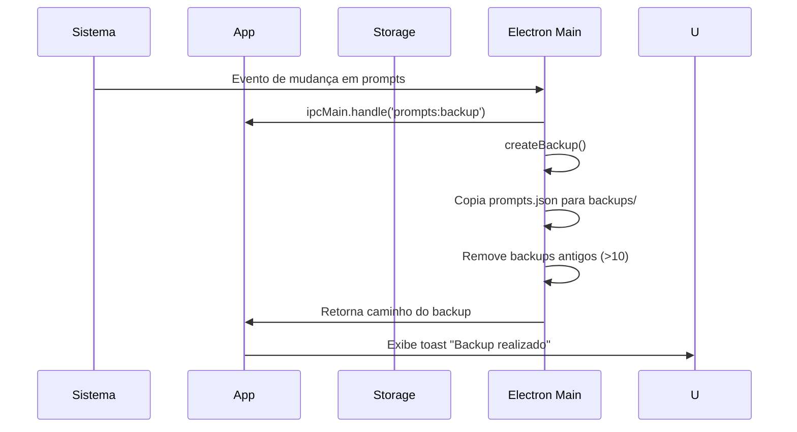
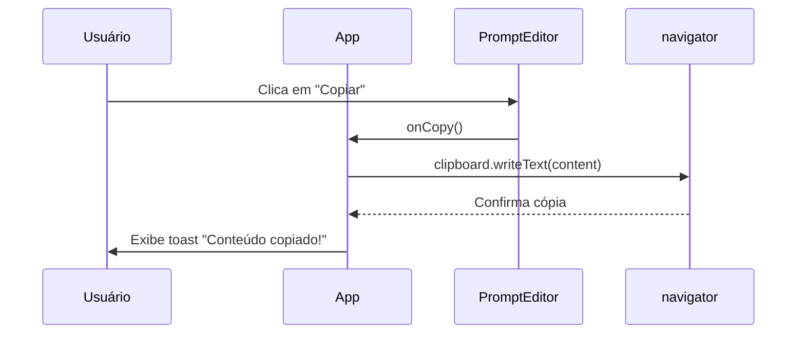

# Diagramas de Sequência

## 1. Fluxo: Criar Novo Prompt

## 2. Fluxo: Editar Prompt

## 3. Fluxo: Excluir Prompt

## 4. Fluxo: Buscar e Filtrar

## 5. Fluxo: Exportar Prompts

## 6. Fluxo: Importar Prompts

## 7. Fluxo: Backup Automático (Electron)

## 8. Fluxo: Copiar Conteúdo

